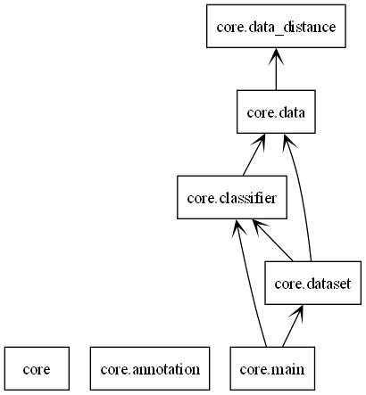
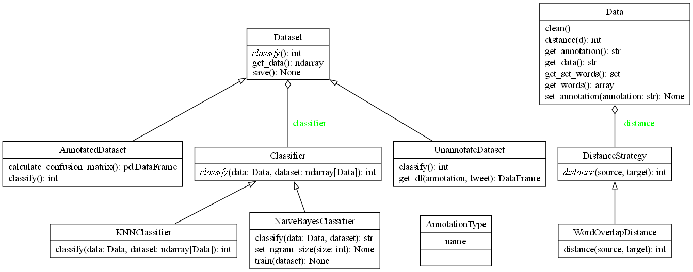
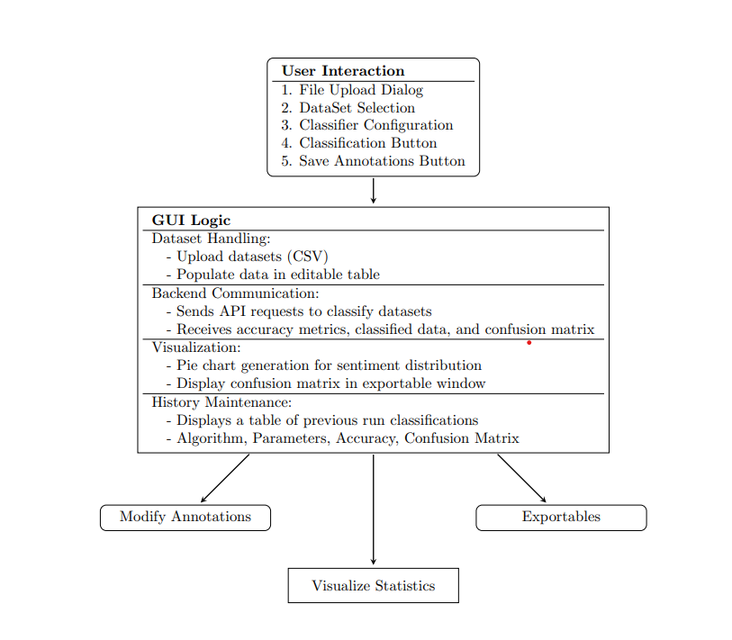
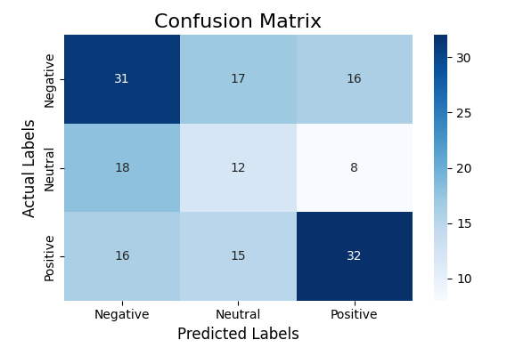
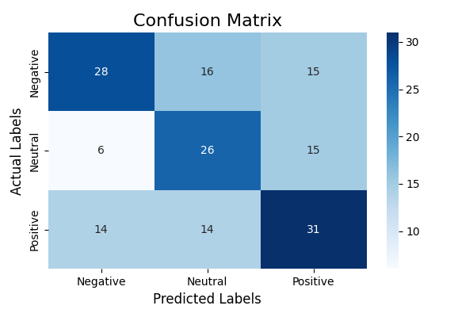
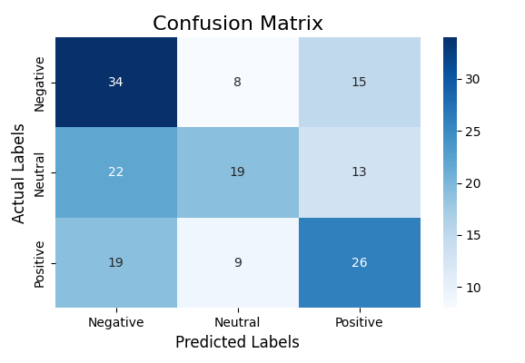
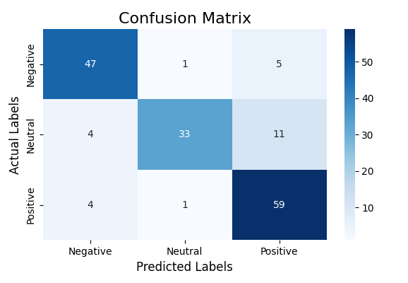
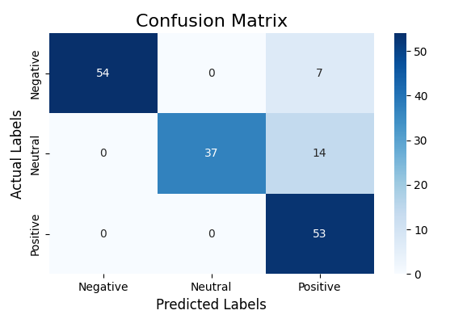

# pje

## Authors

Ali Ashraf
Thibault Tisserand

## Installation

```bash
# Cloning repository
git clone https://gitlab-etu.fil.univ-lille.fr/thibault.tisserand.etu/pje.git
cd pje

# Install dependencies
pip install -r requirements.txt
# or 
pip install PyQt6 "fastapi[standard]" numpy tqdm seaborn pandas matplotlib scikit-learn requests

# Starting the api
cd api/src/
uvicorn main:app --host localhost --port 8000

# Starting the application
cd app/src/
python main.py
```

## Description générale du projet

### Description de la problématique

Ce projet a pour but de concevoir une application capable de classifier le sentiment général (positif, négatif, neutre) exprimé dans des tweets portant sur un sujet spécifique. Pour atteindre cet objectif, plusieurs algorithmes d'apprentissage supervisé classiques, notamment le Dictionnaire, KNN et Bayes, seront mis en œuvre. Les performances de ces approches seront ensuite comparées et analysées afin d'identifier les plus adaptées à cette problématique.

### Description générale de l'architecture du projet

Le projet est structuré en trois "packages" principaux :

- `api` : Ce package sert d'interface entre l'application graphique et la logique de machine learning.
- `app` : Il correspond à l'interface graphique du projet, qui utilise l'API pour interagir avec le reste de l'application.
- `core` : Ce package contient toute la logique liée au machine learning et aux classifieurs.

L'API a été développée avec `FastAPI` et représente une petite partie du projet. L'application graphique, quant à elle, a été réalisée avec `PyQT6`, une bibliothèque Python dédiée à la création d’applications de bureau. Enfin, la partie `core` a été entièrement codée à la main en s’appuyant uniquement sur `numpy` pour garantir de bonnes performances et sur `tqdm` pour afficher une barre de progression lors des itérations.

La partie core utilise des principes de programmation orientée objet, comme le polymorphisme, ainsi que des design patterns tels que Strategy. Ce dernier a été mis en place pour anticiper l'ajout futur de nouveaux classifieurs, ce qui s'est avéré très utile pour intégrer le classifieur Bayesien par la suite.

[insert image of class diagram]

### Description de l'organisation au sein du binôme

Pour l'organisation dans le binôme, nous avons d'abord chacun travaillé sur le code des premières séances séparément, en utilisant des branches distinctes, ce qui nous a permis de pratiquer individuellement. Par la suite, nous avons regroupé tout le code pour avancer ensemble sur le projet. Ali s'est principalement occupé de la partie graphique tout en proposant des idées pour améliorer l'IA. Thibault, de son côté, a pris en charge la partie core, en développant des classes qui facilitent l'intégration avec l'API. Concernant l'API, nous avons travaillé ensemble dessus, car elle constitue le lien direct entre nos deux parties.

## Détails des différents travaux réalisés

### Préparation/nettoyage des données, base d'apprentissage

Cleaning and preprocessing of the dataset for sentiment analysis required careful addressing the various types of noise and inconsistencies found in raw tweet data. Tweets often include elements like mentions (`@username`), hashtags (`#topic`), retweets (`RT`), URLs, emojis, excessive punctuation, letter repetation and extra spaces. To improve the quality of the dataset, these irrelevant components were programmatically removed using regular expression patterns. This process involved eliminating mentions, hashtags, and URLs to discard non essential information, as well as removing emojis to prevent them from introducing unrelated patterns into the analysis.

Beyond stripping out unnecessary elements, the cleaning process focused on standardizing the text to ensure consistency across all tweets. Punctuation was handled by adding spaces before punctuation marks when they followed letters, removing redundant punctuation such as multiple commas or exclamation points, and consolidating multiple spaces into a single space to maintain uniformity. Additionally, letter repetitions were normalized to reduce variability and ensure that words were consistently represented. By implementing these comprehensive cleaning steps, the dataset was transformed into a cleaner and more standardized form, providing a solid foundation for accurate and effective sentiment analysis using machine learning techniques.

### Algorithmes de classification

Pour le projet, nous avons implémenté quatre algorithmes de classification. Le premier consistait à utiliser deux dictionnaires de mots : l'un contenant l'ensemble des mots positifs et l'autre l'ensemble des mots négatifs. Cette méthode, bien qu'introduite comme une approche de base, a montré ses limites pour la classification des tweets. Par conséquent, nous ne l'avons pas conservée dans notre application finale.

Nous avons ensuite implémenté le classifieur KNN (k-nearest neighbors), qui repose sur le calcul de la distance entre le tweet à classifier et tous les tweets de notre jeu d'entraînement. Une fois cette étape réalisée, nous sélectionnons les k voisins les plus proches (un paramètre défini par l'utilisateur via notre interface graphique), déjà classifiés, et comptons le nombre de voisins positifs, neutres ou négatifs. Enfin, en fonction des annotations de ces k voisins, nous déterminons l'annotation finale du tweet original. Par ailleurs, le classifieur KNN intègre le design pattern Strategy, permettant d'utiliser différentes formules pour le calcul des distances.

Par la suite, nous avons implémenté un classifieur Bayesien en utilisant deux approches principales pour représenter les tweets. Dans un premier temps, nous avons opté pour une représentation par présence : chaque mot du vocabulaire est traité comme un attribut booléen indiquant sa présence ou son absence dans un tweet. Nous avons ignoré des aspects comme l’ordre des mots, leur syntaxe ou leur fréquence, ce qui simplifie considérablement le modèle. En appliquant le théorème de Bayes, nous avons calculé la probabilité qu’un tweet appartienne à une classe donnée (positive, neutre ou négative) en combinant les probabilités des mots présents dans le tweet pour chaque classe. La classe ayant la probabilité la plus élevée était attribuée au tweet.

Pour améliorer ce modèle, nous avons implémenté une variante basée sur la représentation par fréquence. Cette approche prend en compte non seulement la présence d’un mot, mais également le nombre de fois qu’il apparaît dans le tweet (sac de mots). Cela a nécessité une modification de l’équation pour inclure la fréquence de chaque mot, tout en conservant la logique générale du modèle Bayesien. Enfin, pour optimiser le classifieur, nous avons filtré les mots non significatifs, tels que les articles ou pronoms de moins de trois lettres, et expérimenté avec des n-grammes (bi-grammes et combinaisons uni-grammes + bi-grammes) afin de capturer des relations entre mots et d’améliorer les performances globales.

Diagramme du package de la partie IA:



Diagramme de classe de la partie IA:



### Interface graphique

The sentiment analysis application has user friendly GUI built with **PyQt6**. This interface allows users to easily interact with the system through various functionalities.

- **File Upload**
  - Upload annotated or unannotated datasets via a file dialog using the `handle_upload()` method.
  - Displays the uploaded data in a table for easy viewing and verification.

- **Algorithm Selection**
  - Choose between **K-Nearest Neighbors (KNN)** and **Naive Bayes** from a dropdown menu along with hyperparameter values.
  - Classify tweets using the selected algorithm with the `classify_tweets()` function.

- **Sentiment Classification**
  - Automatically categorize tweets as **Negative**, **Neutral**, or **Positive**.
  - Manually adjust sentiment labels if needed in GUI, with changes reflected in the dataset.

- **Saving Annotations**
  - Save the updated dataset in CSV format using the `save_annotations()` method.
  - Select the save location through a dialog prompt.

- **Visualization**
  - **Pie Chart:** Visualize sentiment distribution with the `show_pie_chart()` function, which updates in real-time.
  - **Confusion Matrix:** View classification accuracy and errors through a heatmap generated by the `show_confusion_matrix()` function.

- **Model Training History**
  - Maintain a history of the model trainings, including model names, hyperparameters, confusion matrix images and accuracy, stored in a json file.

User Interface (UI)




## Résultats de la classification avec les différentes méthodes et analyse

Les résultats présentés dans les matrices de confusion ci-dessous illustrent les performances des algorithmes de classification implémentés dans le projet.
Les différentes configurations testées, incluant le classifieur KNN avec divers k (k=1, k=3, k=5) ainsi que le classifieur Bayesien avec différentes représentations
d’ngrams (n=1, n=2, n=3), révèlent des variations dans la précision et les erreurs des prédictions.

Pour le KNN, on peut constater que la valeur de k influence directement le compromis entre précision et stabilité. Par exemple, un k=1 montre des erreurs plus
significatives sur les classes "Neutral" et "Positive", suggérant une sensibilité accrue au bruit dans les données d'entraînement. À l'inverse, des valeurs plus
élevées comme k=5 tendent à réduire l'impact de ces fluctuations, tout en maintenant une bonne précision globale.

Du côté du Naive Bayes, les représentations basées sur des ngrams montrent une nette amélioration au fur et à mesure que le modèle intègre davantage de contextes
linguistiques. Les ngrams de taille 1 (unigrams) affichent des performances correctes mais limitées dans la capture des relations complexes entre mots, tandis que
les bigrams et trigrams renforcent significativement la précision, en particulier pour les classes avec des nuances de sentiment, comme "Neutral".

Ces résultats nous montrent l'intérêt d'ajuster les hyperparamètres et les représentations textuelles selon les spécificités des données pour obtenir
des modèles plus robustes et performants. Cette analyse nous permet également de constater les forces respectives des approches KNN (adaptabilité locale) et Naive
Bayes (gestion efficace des relations textuelles).

                  - KNN-Classifier with KNN 1


                  - KNN-Classifier with KNN 3


                  - KNN-Classifier with KNN 5


                  - Naive Bayes with Ngram 1


                  - Naive Bayes with Ngram 2


                  - Naive Bayes with Ngram 3


## Conclusions

En conclusion, les résultats obtenus à travers l’analyse des matrices de confusion mettent en évidence l’impact des hyperparamètres et des représentations
textuelles sur les performances des modèles. Les tests réalisés avec différentes valeurs de k pour le KNN et les variations d’ngrams pour le Naive Bayes
montrent clairement que chaque configuration offre des avantages et des limites selon le contexte. Par exemple, un faible k peut être plus précis pour
des données moins bruitées, mais plus sensible aux erreurs, tandis que des ngrams plus complexes améliorent la compréhension des relations entre mots,
renforçant ainsi la robustesse du modèle.

Ce projet nous a permis d'apprendre des concepts du machine learning tout en ajoutant nos connaissances en programmation orientée objet, et en développant
une application complète, de l'analyse des données à la conception de l'interface utilisateur. Grâce à l’implémentation de plusieurs algorithmes de classification, nous avons
pu comparer leurs performances et mieux comprendre leurs avantages et limites respectifs.

La structure modulaire de notre projet, organisée en api, app et core, a facilité le travail en groupe et a rendu l’ajout de nouvelles fonctionnalités, comme le classifieur Bayesien, plus intuitif.

Enfin, ce projet a renforcé notre compréhension de l’analyse de texte, notamment la gestion des données bruitées et le choix des représentations textuelles les plus pertinentes.
Les résultats obtenus montrent que, même avec des algorithmes relativement simples, il est possible d'obtenir des performances intéressantes, tout en ouvrant des perspectives pour
des améliorations futures, comme l'intégration de modèles plus avancés ou l'exploration d'autres techniques de traitement de texte.
